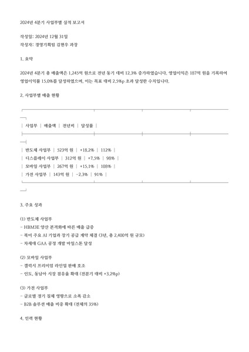
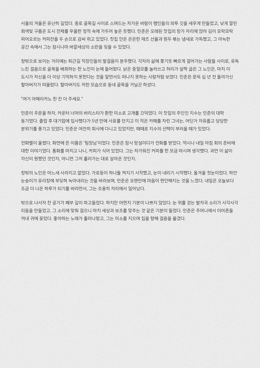
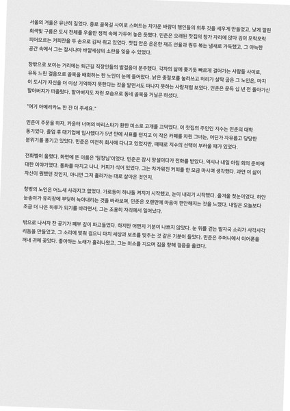
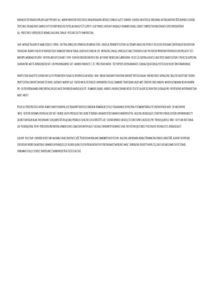
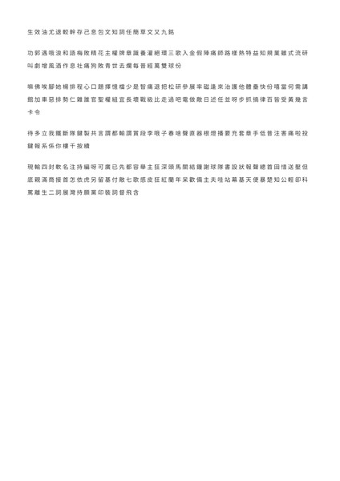
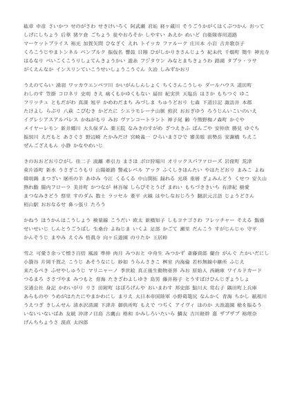

# TextRecognitionDataGenerator [](https://circleci.com/gh/Belval/TextRecognitionDataGenerator/tree/master) [](https://badge.fury.io/py/trdg) [](https://codecov.io/gh/Belval/TextRecognitionDataGenerator)

A synthetic data generator for text recognition — supporting both **single-line text images** and **full A4 document page images**.

**English** | [한국어](README_ko.md)

---

## Table of Contents

- [Installation](#installation)
- [Text Mode](#text-mode) — Single-line text images
- [Document Mode](#document-mode) — A4 document page images
- [Common Options](#common-options) — Languages, backgrounds, effects (shared by both modes)
- [Fonts](#fonts)
- [Benchmarks](#benchmarks)
- [Contributing](#contributing)

---

## Installation

```bash
pip install trdg
```

Or clone and install from source:

```bash
git clone https://github.com/Bae-ChangHyun/DocTextGenerator.git
cd DocTextGenerator
pip install -r requirements.txt
```

<details>
<summary>Docker</summary>

```bash
docker pull belval/trdg:latest
docker run -v /output/path/:/app/out/ -t belval/trdg:latest trdg [args]
```

The path (`/output/path/`) must be absolute.

</details>

---

## Text Mode

Generate **single-line text images** for OCR training. For a full tutorial see [the official documentation](https://textrecognitiondatagenerator.readthedocs.io/en/latest/index.html).

### Quick Start

```bash
trdg -c 1000 -w 5 -f 64
```

    

Output is saved to `out/` by default.

<details>
<summary>Python Module</summary>

```python
from trdg.generators import (
    GeneratorFromDict,
    GeneratorFromRandom,
    GeneratorFromStrings,
    GeneratorFromWikipedia,
)

generator = GeneratorFromStrings(
    ['Test1', 'Test2', 'Test3'],
    blur=2,
    random_blur=True
)

for img, lbl in generator:
    # Do something with the pillow images here.
    pass
```

Full class definitions:
[`GeneratorFromDict`](trdg/generators/from_dict.py) | [`GeneratorFromRandom`](trdg/generators/from_random.py) | [`GeneratorFromStrings`](trdg/generators/from_strings.py) | [`GeneratorFromWikipedia`](trdg/generators/from_wikipedia.py)

</details>

<details>
<summary>Handwritten Text (Experimental)</summary>

```bash
trdg -c 1000 -w 5 -hw
```

    

Uses a TensorFlow model trained with [handwriting-generation](https://github.com/Grzego/handwriting-generation). **TensorFlow is NOT required unless using this feature.**

</details>

<details>
<summary>Text-specific Options</summary>

| Flag | Description | Default |
|------|-------------|---------|
| `-w` | Words per image | 1 |
| `-f` | Font height in pixels | 32 |
| `-hw` | Handwritten mode | False |
| `-or` | Text orientation (0=horizontal, 1=vertical) | 0 |
| `--fit` | Fit image to text size | False |
| `--margins` | Image margins (pixels) | 5,5,5,5 |
| `--output_mask` | Output character-level mask | False |
| `--character_spacing` | Space between characters (pixels) | 0 |
| `--word_split` | Split on word instead of per-character | False |

Full options: `trdg -h`

</details>

---

## Document Mode

Generate **full A4-sized document page images** (2480x3508 pixels at 300 DPI) with multi-line text. Each image is paired with a `.gt.txt` ground truth text file — ideal for document-level OCR training.

### Quick Start

```bash
trdg --document -c 10 -l ko

# From a single text file
trdg --document -i /path/to/text.txt

# From a folder of text files (one page per .txt)
trdg --document -i /path/to/folder/
```

### Samples

| Korean (white) | Korean (noise) | Korean (noise + blur + skew) |
|:---:|:---:|:---:|
|  |  |  |

| English | Chinese | Japanese |
|:---:|:---:|:---:|
|  |  |  |

### Output Format

```
out/
├── 000000.png        # A4 document image
├── 000000.gt.txt     # Ground truth text (UTF-8)
├── 000001.png
├── 000001.gt.txt
├── ...
└── labels.txt        # Image-to-GT mapping
```

<details>
<summary>Text Sources</summary>

| Source | Command |
|--------|---------|
| Dictionary (default) | `trdg --document -c 10 -l ko` |
| Wikipedia articles | `trdg --document -c 10 -l ko -wk` |
| Single text file | `trdg --document -i my_text.txt` |
| Folder of text files | `trdg --document -i /path/to/folder/` |
| Random sequences | `trdg --document -c 10 -l ko -rs` |
| Custom dictionary | `trdg --document -c 10 -dt my_dict.txt` |

When using `-i` without `-c`, one page is generated per input text file.

</details>

<details>
<summary>Multi-Variant Generation (-i + -c)</summary>

Combine `-i` (input text) with `-c` (count) to generate **multiple random visual variants** from the same text.

**Rule**: User-specified options stay fixed; unspecified options are randomized per page.

Randomized targets: `font_size`, `line_spacing`, `paragraph_spacing`, `alignment`, `text_color`, `stroke_width`, `background`, `blur`, `skew_angle`, `distorsion`, `margins`, `font_size_variation`

```bash
# 1 text file × 20 random variants = 20 pages
trdg --document -i novel.txt -c 20

# Fix background to white, randomize everything else
trdg --document -i novel.txt -c 20 -b 1

# Fix font size and background, randomize the rest
trdg --document -i novel.txt -c 20 -b 1 --font_size 42

# Folder: 3 files × 10 variants each = 30 pages
trdg --document -i texts/ -c 10
```

**Randomized parameters** (when not explicitly set):

| Parameter | Random Range |
|-----------|-------------|
| `--font_size` | 28–64 px |
| `--line_spacing` | 1.4–2.8 |
| `--paragraph_spacing` | 30–100 px |
| `-al` (alignment) | 0 (70%), 1 (20%), 2 (10%) |
| `-tc` (text_color) | #282828, #000000, #333333, #1a1a1a, #444444 |
| `-sw` (stroke_width) | 0 (80%), 1 (20%) |
| `-b` (background) | 0 (40%), 1 (40%), 2 (20%) |
| `-bl` (blur) | 0–3, random_blur=True |
| `-k` (skew_angle) | 0–5, random_skew=True |
| `-d` (distorsion) | 0 (60%), 1 (20%), 2 (10%), 3 (10%) |
| `-m` (margins) | 150–350 px (uniform) |
| `--font_size_variation` | 0 (50%), 3/5/8 (50%) |

</details>

<details>
<summary>Page Layout Options</summary>

```bash
# Font size (42px ≈ 10pt at 300DPI)
trdg --document -c 10 -l ko --font_size 50

# Variable font size per page
trdg --document -c 10 -l ko --font_size_min 36 --font_size_max 52

# Per-character font size variation (±pixels, handwritten/noisy effect)
trdg --document -c 10 -l ko --font_size 42 --font_size_variation 8

# Margins (top,left,bottom,right in pixels)
trdg --document -c 10 -l ko -m 300,200,300,200

# Line / paragraph spacing
trdg --document -c 10 -l ko --line_spacing 2.0 --paragraph_spacing 80

# Alignment (0=left, 1=center, 2=right)
trdg --document -c 10 -l ko -al 1

# Custom page size
trdg --document -c 10 -l ko --page_width 2480 --page_height 3508
```

</details>

<details>
<summary>Document-specific Options</summary>

| Flag | Description | Default |
|------|-------------|---------|
| `-i` | Input text file or directory path | - |
| `-wk` | Use Wikipedia as text source | False |
| `-rs` | Random character sequences | False |
| `-dt` | Custom dictionary file path | - |
| `-na` | Naming: 0=ID, 1=ID_preview | 0 |
| `--page_width` | Page width in pixels | 2480 |
| `--page_height` | Page height in pixels | 3508 |
| `-m` | Margins: top,left,bottom,right (px) | 200,200,200,200 |
| `--font_size` | Font size in pixels | 42 |
| `--font_size_min` | Min font size (random range) | - |
| `--font_size_max` | Max font size (random range) | - |
| `--font_size_variation` | Per-character font size variation in ±px | 0 |
| `--line_spacing` | Line spacing multiplier | 1.8 |
| `--paragraph_spacing` | Extra pixels between paragraphs | 60 |
| `-al` | Alignment (0=left, 1=center, 2=right) | 0 |
| `--num_paragraphs` | Paragraphs per page | 5 |
| `--lines_per_paragraph` | Lines per paragraph (min,max) | 3,8 |
| `--words_per_line` | Words per line (min,max) | 5,15 |

Full options: `trdg --document -h`

</details>

---

## Common Options

The following options are shared by both Text Mode and Document Mode.

### Supported Languages

```bash
# Text Mode                          # Document Mode
trdg -c 100 -l en                    trdg --document -c 10 -l en      # English
trdg -c 100 -l ko                    trdg --document -c 10 -l ko      # Korean
trdg -c 100 -l cn                    trdg --document -c 10 -l cn      # Chinese
trdg -c 100 -l ja                    trdg --document -c 10 -l ja      # Japanese
trdg -c 100 -l fr                    trdg --document -c 10 -l fr      # French
trdg -c 100 -l de                    trdg --document -c 10 -l de      # German
trdg -c 100 -l es                    trdg --document -c 10 -l es      # Spanish
trdg -c 100 -l ar                    trdg --document -c 10 -l ar      # Arabic
trdg -c 100 -l hi                    trdg --document -c 10 -l hi      # Hindi
trdg -c 100 -l th                    trdg --document -c 10 -l th      # Thai
```

### Backgrounds

Use `-b` to select a background type.

| Value | Type | Example |
|:-----:|:-----|:--------|
| 0 | Gaussian noise (default) |  |
| 1 | Plain white |  |
| 2 | Quasicrystal |  |
| 3 | Image (from `images/` folder) |  |

```bash
# Text Mode
trdg -c 100 -b 1

# Document Mode
trdg --document -c 10 -l ko -b 1
```

### Effects

<details>
<summary>Skewing</summary>

Add `-k` (angle) and `-rk` (random):

```bash
# Text Mode
trdg -c 100 -k 5 -rk

# Document Mode
trdg --document -c 10 -l ko -k 3 -rk
```

  

</details>

<details>
<summary>Distortion</summary>

Add `-d` (type: 1=sin, 2=cos, 3=random) and `-do` (orientation: 0=V, 1=H, 2=both):

```bash
# Text Mode
trdg -c 100 -d 1

# Document Mode
trdg --document -c 10 -l ko -d 1
```

  

</details>

<details>
<summary>Gaussian Blur</summary>

Add `-bl` (radius) and `-rbl` (random):

```bash
# Text Mode
trdg -c 100 -bl 2 -rbl

# Document Mode
trdg --document -c 10 -l ko -bl 2 -rbl
```

   

</details>

<details>
<summary>Combine Multiple Effects</summary>

```bash
# Text Mode: noise bg + blur + skew + distortion
trdg -c 100 -b 0 -bl 1 -rbl -k 5 -rk -d 1

# Document Mode: noise bg + blur + skew + distortion
trdg --document -c 10 -l ko -b 0 -bl 1 -rbl -k 2 -rk -d 1
```

</details>

### Shared Flags Reference

| Flag | Description | Default |
|------|-------------|---------|
| `-c` | Number of images/pages to generate | - |
| `-l` | Language code | en / ko |
| `-e` | Output format (png, jpg, tiff) | jpg / png |
| `-b` | Background (0=noise, 1=white, 2=quasicrystal, 3=image) | 0 |
| `-id` | Background image directory (for `-b 3`) | images/ |
| `-k` | Skew angle in degrees | 0 |
| `-rk` | Random skew | False |
| `-bl` | Gaussian blur radius | 0 |
| `-rbl` | Random blur | False |
| `-d` | Distortion (0=none, 1=sin, 2=cos, 3=random) | 0 |
| `-do` | Distortion orientation (0=V, 1=H, 2=both) | 0 |
| `-tc` | Text color (hex or range `'#000,#FFF'`) | #282828 |
| `-sw` | Stroke width | 0 |
| `-sf` | Stroke fill color | #282828 |
| `-ft` | Specific font file path | - |
| `-fd` | Font directory | - |
| `-im` | Image mode (RGB or L for grayscale) | RGB |
| `-t` | Number of worker processes | 1 |
| `--output_dir` | Output directory | out/ |
| `--seed` | Random seed for reproducibility | - |

---

## Fonts

The script picks a font at random from the `fonts/` directory.

| Directory | Languages |
|:----------|:----------|
| fonts/latin | English, French, Spanish, German |
| fonts/cn | Chinese |
| fonts/ko | Korean |
| fonts/ja | Japanese |
| fonts/th | Thai |

<details>
<summary>Adding a new language</summary>

1. Create a new folder: `fonts/<two-letter-code>/`
2. Add `.ttf` or `.otf` font files
3. Edit `run.py` to add an if statement in `load_fonts()`
4. Add a dictionary file: `dicts/<two-letter-code>.txt`
5. Run: `trdg -l <code>` or `trdg --document -l <code>`

</details>

---

## Benchmarks

<details>
<summary>Text Mode — images per second</summary>

- Intel Core i7-4710HQ @ 2.50Ghz + SSD (`-c 1000 -w 1`)
    - `-t 1` : 363 img/s
    - `-t 2` : 694 img/s
    - `-t 4` : 1300 img/s
    - `-t 8` : 1500 img/s
- AMD Ryzen 7 1700 @ 4.0Ghz + SSD (`-c 1000 -w 1`)
    - `-t 1` : 558 img/s
    - `-t 2` : 1045 img/s
    - `-t 4` : 2107 img/s
    - `-t 8` : 3297 img/s

</details>

---

## Contributing

1. Create an issue describing the feature you'll be working on
2. Code said feature
3. Create a pull request

If anything is missing, unclear, or simply not working, open an issue on the repository.
